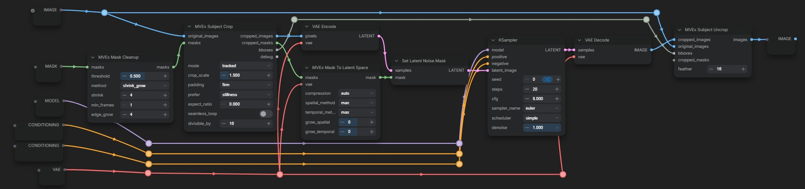
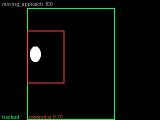
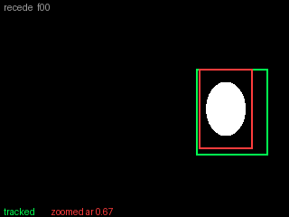
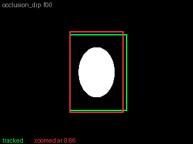
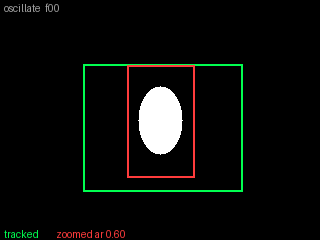
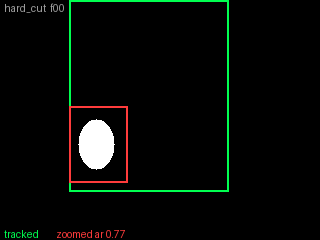
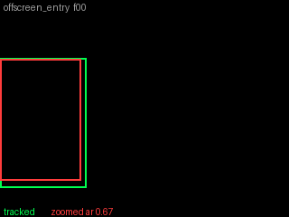

# MaskVidExperiments

Video masking tools for ComfyUI: process a masked subject at high resolution
inside a moving crop, then paste the result back into the original frames
without jitter or visible seams.

Naive per-frame crops around a moving subject jitter in position and size,
and video models read that jitter as camera motion. Subject Crop produces
batches that are stable by construction: the crop holds still through mask
noise, occlusions, and brief excursions, and follows only sustained motion.



Mask Cleanup removes segmentation noise, Subject Crop cuts a stable batch
around the subject, sampling runs on the crops (optionally masked via Mask
To Latent Space into Set Latent Noise Mask), and Subject Uncrop pastes the
result back into the full frames.

## Examples

### Subject Crop / Uncrop

Synthetic stress cases at default settings. Green is the tracked crop, red
is zoomed.

| | |
|---|---|
|  |  |
| Subject grows while crossing the frame: zoomed follows position and size smoothly, tracked shows the constant-size answer. | Subject shrinks and is still moving at the last frame: the clip ends on a steady, fully padded crop. |
|  |  |
| The face-mask case, where half the mask vanishes for a stretch: the crops don't react. | Side-to-side swings: absorbed by a slightly roomier crop that stays put instead of chasing every reversal. |
|  |  |
| Scene cut: one clean jump to the new framing, no hunting before or after. | Subject enters from off-screen: the clipped mask distorts the apparent size, but the crop settles without lurching. |

### Mask To Latent Space

Replacing a car with a German shepherd in an LTX video: feeding the pixel
mask straight to Set Latent Noise Mask leaves ComfyUI to trilinear-resize it,
which blurs the mask across frames and lets the car bleed through. The
max-reduced mask from Mask To Latent Space inpaints cleanly.


## Installation

Clone into `custom_nodes` and restart ComfyUI. Needs a reasonably recent
ComfyUI install, with no dependencies beyond ComfyUI's own.

```
cd ComfyUI/custom_nodes
git clone https://github.com/drozbay/MaskVidExperiments
```

## Nodes

### MVEx Subject Crop

Crops a region around the masked subject from every frame, sized so the
whole batch stacks into one tensor. Position, size, and shape are chosen
together over the whole clip, so the crop holds still through mask jitter
and follows only sustained motion.

Modes:

- **combined**: one static crop with padding around the subject's whole
  travel.
- **tracked**: a constant-size crop that stays still until the subject
  would leave it, then moves as little as possible. Pixel-exact slices, no
  resampling.
- **zoomed**: the crop also follows the subject's size. Every crop is
  resampled to one fixed output resolution, sized automatically so the
  largest crop stays at 1:1 pixel scale. Because `crop_scale` is a ratio,
  the subject keeps a constant share of the output whatever its size on
  screen.

Inputs:

- `crop_scale`: crop size as a multiple of the subject's size. 1.5 keeps
  the subject at two thirds of the crop with the rest as padding, at any
  resolution.
- `padding`: how firmly the `crop_scale` padding is kept. `guaranteed` is
  never less than promised on any frame, whatever it costs in size or
  movement (only the image edge can break it, and mask noise counts as
  subject, so clean the masks first). `firm` always keeps at least 70% and
  lets the rest yield briefly during fast motion. `flexible` lets padding
  yield first whenever keeping it would cost stillness or tightness.
- `prefer`: what pays for keeping the padding when the subject moves.
  `stillness` runs a larger crop so it can move and rescale less.
  `tightness` keeps the crop as small as the padding allows and moves as
  much as needed.
- `aspect_ratio`: crop shape as width divided by height (e.g. 1.78). 0
  picks the shape that best fits the clip. In zoomed mode the output
  resolution matches it exactly.
- `seamless_loop`: plans the crop path so the last frame wraps seamlessly
  into the first. Only for clips that genuinely repeat.
- `pad_surplus_tol` (zoomed): extra padding lasting shorter than this many
  frames is kept rather than trimmed, riding out occlusions and dips at a
  steady size.
- `zoom_step` (zoomed): above 1.0, crop size snaps to discrete zoom levels
  this ratio apart instead of changing smoothly.
- `divisible_by`: crop width and height are rounded up to a multiple of
  this. Match the model's resolution requirement.

Outputs:

- `cropped_images` and `cropped_masks`: the crops, plus the input masks
  cropped to the same boxes.
- `bboxes`: one box per frame for Subject Uncrop, using ComfyUI's native
  BOUNDING_BOX type.
- `debug`: a text summary of the result: chosen shape, box sizes, movement,
  and how much of the promised padding was kept.

**MVEx Subject Crop (Advanced)** exposes every internal dial. The standard
node's `padding` and `prefer` settings are presets over them, and the
advanced defaults reproduce its firm/stillness combination.

### MVEx Subject Uncrop

Pastes processed crops back into the original frames with a feathered
border, optionally confined by a mask. The paste is pixel-exact when the
crop size was not changed.

- `feather`: blend width in pixels, feathered inward from the crop border.
  Sides touching the image edge are not feathered.
- `cropped_masks` (optional): confines the paste to the subject. The mask
  is used exactly as given, so pre-blur it upstream if you want a soft
  matte edge.
- `bboxes` accepts one box per frame or a single box applied to every
  frame, float coordinates included.
- Input order is bypass-correct: bypassing both Subject Crop and Subject
  Uncrop passes the processed frames straight through, so the whole crop
  pipeline can be A/B'd with two clicks.

### MVEx Mask Cleanup

Removes specks and brief flickering blobs from a video mask batch while
keeping the real subject, including its soft edges.

- `shrink_grow` method: shrinks the mask so thin specks vanish, then
  restores the surviving blobs' exact shapes.
- `components` method: drops blobs that are both small (`min_pixels`) and
  short-lived (`min_frames`).
- `edge_grow`: grows kept regions back out so the subject's soft edges are
  preserved.

### MVEx Frame Range Mask

Builds a batch of solid masks at a given resolution, fully masked on the
frames you list and empty on the rest. Useful for masking a stretch of a
clip for inpainting, or for feeding a temporal mask straight into Mask To
Latent Space.

### MVEx Mask To Latent Space

Reduces a pixel-space mask batch to latent resolution using the VAE's
spatial and temporal compression, aligned to how causal video VAEs group
frames (first frame alone, then groups of N, as in Wan, Hunyuan, and LTX).
Feed the result to Set Latent Noise Mask.

- `compression`: `auto` reads the compression factors from the connected
  VAE, `manual` enters them directly.
- `spatial_method` and `temporal_method`: how a block of pixels or a group
  of frames reduces to one latent cell. `max` marks the cell if any covered
  pixel or frame is masked, `min` only if all are, `mean` blends.
- `grow_spatial` and `grow_temporal`: grow (+) or shrink (-) the mask in
  pixels and frames before reduction.

### MVEx Audio Mask To Latent

The audio counterpart: regenerates the chosen time ranges of an audio
latent and keeps the rest, on a joint AV latent (MiniMax H3, LTX-2) or a
bare audio latent. Timing and layout come from the connected audio VAE or
from manual widgets, ranges from `time_ranges` text, a timeline mask, or
start/end times. The node attaches the noise mask itself, since Set Latent
Noise Mask cannot reach the audio side of a joint latent, and merges with
any mask already there so copies chain. **MVEx Audio Mask Debug** reports
which time ranges a latent's audio mask keeps and regenerates.

### MVEx Differential Diffusion (Soft)

Drop-in variant of ComfyUI's Differential Diffusion. The stock node turns a
grayscale denoise mask into hard binary masks that grow as sampling
proceeds, so every intermediate mask has a razor-sharp edge no matter how
feathered the input was. This version thresholds with a soft ramp instead,
so each per-step mask keeps a soft edge whose width follows the blur
already present in the input mask: heavily feathered masks stay feathered
at every step, sharp masks stay sharp. Purely per-pixel with no spatial
blur, so it is temporally stable on video.

- `softness`: width of the threshold band in mask-value units. 0 exactly
  reproduces the stock node; 1 disables the schedule and blends by the
  mask as-is. The endpoints stay aligned with the stock schedule: fully
  masked pixels denoise from the first step, unmasked pixels never do.
- `strength`: blend between the scheduled mask and the raw input mask,
  as in the stock node.

## Acknowledgements

- The batchcrop nodes in [ComfyUI-KJNodes](https://github.com/kijai/ComfyUI-KJNodes)
  (which trace back to [comfy_mtb](https://github.com/melMass/comfy_mtb))
  are the prior art that motivated this design. Subject Crop and Subject
  Uncrop are an independent reimplementation with no code carried over, but
  they exist because those nodes proved the workflow worth doing.
- [ComfyUI-Inpaint-CropAndStitch](https://github.com/lquesada/ComfyUI-Inpaint-CropAndStitch)
  is the mature crop-and-stitch solution for still-image inpainting. Use it
  for single images; this pack covers the video case, where applying that
  workflow per frame produces exactly the jitter described above.
- Mask To Latent Space generalizes WanMaskToLatentSpace from my
  [ComfyUI-WanVaceAdvanced](https://github.com/drozbay/ComfyUI-WanVaceAdvanced).
- Most of the code in this pack was written with Claude (Fable 5).

License: GNU GPLv3, Copyright (C) 2026 drozbay
